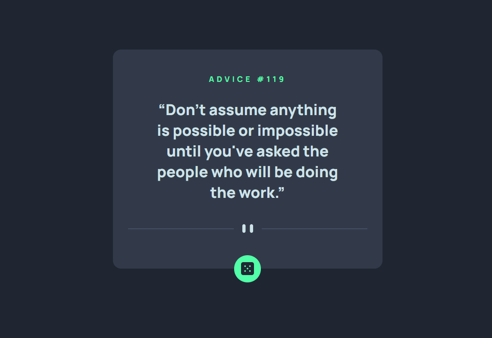

# Frontend Mentor - Advice generator app solution

This is a solution to the [Advice generator app challenge on Frontend Mentor](https://www.frontendmentor.io/challenges/advice-generator-app-QdUG-13db). Frontend Mentor challenges help you improve your coding skills by building realistic projects.

## Table of contents

- [Overview](#overview)
  - [The challenge](#the-challenge)
  - [Screenshot](#screenshot)
  - [Links](#links)
- [My process](#my-process)
  - [Built with](#built-with)
  - [Useful resources](#useful-resources)
- [Author](#author)

## Overview

### The challenge

Users should be able to:

- Get some random advices
- Enjoy the advice if you like it, otherwise click the dice button to get another one

### Screenshot

### Links

- Solution URL: [Github](https://github.com/dbcodedev/advice-generator)
- Live Site URL: [Netlify](https://elegant-almeida-c52ba2.netlify.app/)

## My process

### Built with

- Semantic HTML5 markup
- CSS custom properties
- Flexbox
- [React](https://reactjs.org/) - JS library
- [Axios](https://github.com/axios/axios) - To query the API (but fetch is enough I guess)

### Useful resources

- To learn React on [Scrimba](https://scrimba.com/learn/learnreact)
- To generate [box shadows](https://box-shadow.dev/)

## Author

- David - [Github](https://github.com/dbcodedev)
- Frontend Mentor - [@dbcodedev](https://www.frontendmentor.io/profile/dbcodedev)
- Twitter - [@davidb_77](https://www.twitter.com/davidb_77)
